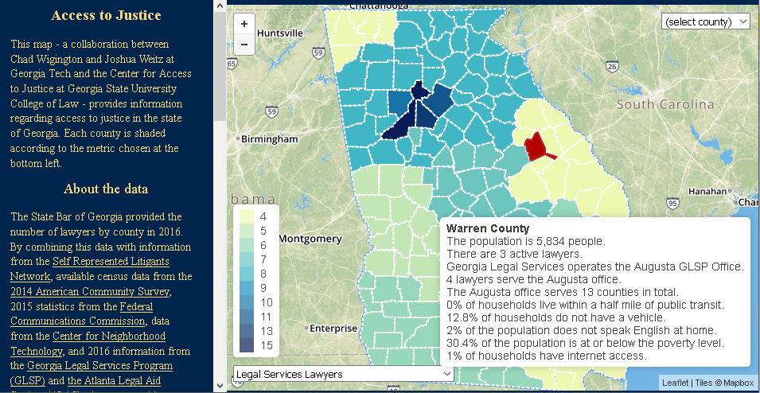

# AccessToJustice

This map - a collaboration between Chad Wigington and Joshua Weitz at Georgia Tech and the Center for Access to Justice at Georgia State University College of Law - provides information regarding access to justice in the state of Georgia. Each county is shaded according to the metric chosen at the bottom left.

### About the data
The State Bar of Georgia provided the number of lawyers by county in 2016. By combining this data with information from the [Self Represented Litigants Network](https://srln.maps.arcgis.com/apps/MapJournal/index.html?appid=7bed22dba4ec45f281b766181b862156), available census data from the [2014 American Community Survey](https://www.census.gov/programs-surveys/acs/about.html), 2015 statistics from the [Federal Communications Commission](https://www.fcc.gov), data from the [Center for Neighborhood Technology](http://alltransit.cnt.org/), and 2016 information from the [Georgia Legal Services Program (GLSP)](http://www.glsp.org/) and [the Atlanta Legal Aid Society (ALAS)](https://www.atlantalegalaid.org/), the map provides insight into attorney representation and other factors that impact access to justice throughout the state.

The “Legal Services Lawyers” metric includes attorneys from ALAS (in Clayton, Fulton, Cobb, DeKalb, and Gwinnett counties) and GLSP (outside the five-county metro Atlanta area served by ALAS). For the ALAS counties, the number of Legal Services Lawyers serving a given county reflects both attorneys assigned to that county and a portion of the 22.5 ALAS attorneys not assigned to a particular county; for example, Cobb County has 6 ALAS lawyers, but its total includes 1/5 of the program-wide attorneys for an additional 4.5 attorneys. By contrast, GLSP attorneys are assigned to a particular region of the state and serve several counties (e.g. attorneys from the Albany-Valdosta office service 29 counties). Thus, outside the five-county metro area, the Legal Services Lawyers total for a particular county includes GLSP lawyers who also serve other counties. GLSP totals for a given county do not include 7 statewide attorneys or the 2 attorneys serving farmworkers throughout the state.

The Center for Neighborhood Technology’s public transit data is only consistently available for counties with more than 100,000 residents. Less populous counties may therefore reflect 0 public transit even where it may be available.

# [Access To Justice](https://cwigington3.github.io/AccessToJustice)

